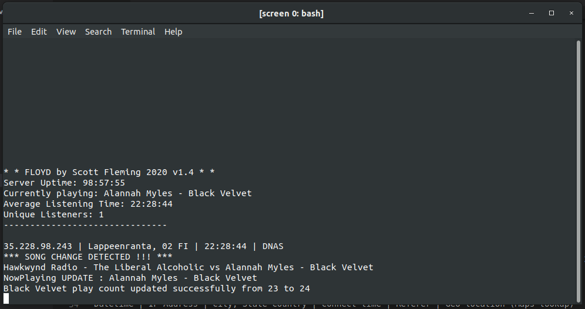

# SC-Analytics - Shoutcast-Server-Monitor (FLOYD)
A simple node application which monitors visitor activity, logging connections to MySQL.
You'll need a shoutcast server running with access to the admin.cgi pages. I run sc_serv on an AWS micro instance running Ubuntu. 

## How It Works
Floyd pings the shoutcast server every 15 seconds, and if the song has changed, updates the Mysql recording play counter.
Floyd then collects listener connection data, peforms geoip lookup on the connected IP address and stores/updates the record in the listeners table. 

The listeners table is used by a seperate project which displays listener activity and analytics. (see other repo)


## Installation

### Create Mysql Database, and create user/password credentials
Import `mysql/stream_mysql.sql` into your database

Edit `config.sample.json` and save it as `config.json`

```json
{
    "shoutcast" : {
        "url": "http://yourserver.org:8000",
        "pass" : "yourpassword_admin",
        "mode" : "viewjson",
        "sid" : 1,
        "path" : "admin.cgi"
    },
    "mysql" : {
        "host": "localhost",
        "user": "MysqlUsername",
        "password": "MysqlPassword",
        "database": "MysqlDatabaseName"
      } 
}
```


## Install the packages and dependencies
`npm run install`

### Run it
`npm run start` 

# Console log report display in command line
```
Server Uptime: 20:03:28
Currently playing: Steely Dan - Deacon Blues
Average Listening Time: 03:31:39
Listeners: 1
10/27/2019, 10:38:12 AM|108.49.69.200|Wellesley Hills, Massachusetts US|03:31:39| DNAS|42.3104,-71.2741
```




## TO-DO / Wants
- [ ] Web console dashboard (in progress)
- [ ] Reporting / Analytics functions for queries
- [ ] Shoutcast Administration functions (kick/ban/reserve)
- [ ] Multiple stream monitoring

Author: Scott Fleming

[hawkwynd@gmail.com](mailto:hawkwynd@gmail.com)

Hawkwynd Radio - Live broadcasts Friday nights 7pm CST 24/7 Classic Rock & Excellent Music

[http://stream.hawkwynd.com](http://stream.hawkwynd.com)